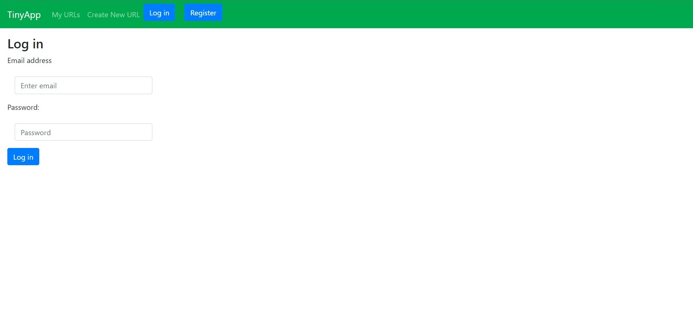
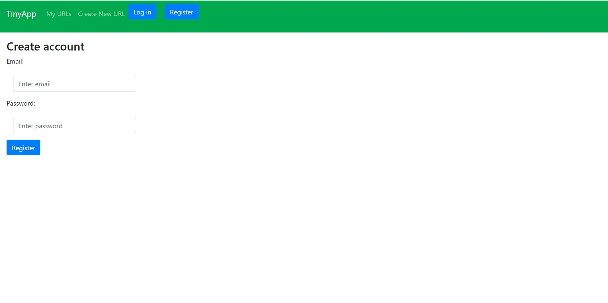
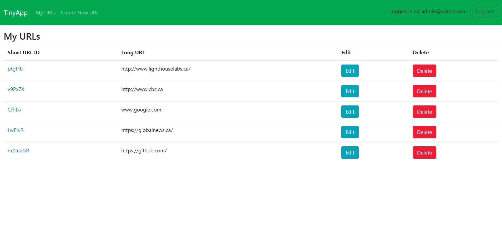
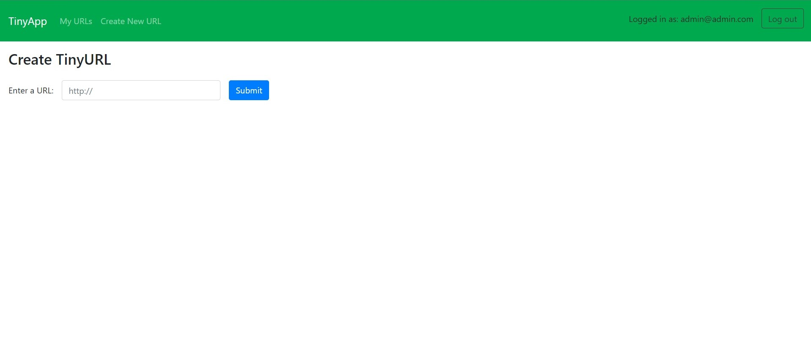

# TinyApp Project

TinyApp-URL shortening service is a full-stack web application built with Node.js and Express that allows users to shorten long URLs similar to TinyURL, Bitly, or Goo.gl. It provides a simple multipage app with authentication protection, dynamically responding to the user's logged-in state. Users can perform CRUD operations (Create, Read, Update, Delete) on a simple entity, which is a URL shortener.

# Purpose

BEWARE: This project was published for learning purposes. It is not intended for use in production-grade software.

This project was created and published by me as part of my learnings at Lighthouse Labs.

# Features

- Secure User Registration and Login System
  - Encrypted cookies
  - Hashed and Salted passwords
- Account-based URL Storage
- Permission-based URL Viewing
  - Only you can see your saved URLs
  - Anyone can access the intended website through your ShortURL 

## Final Product

## Dependencies

- Node.js
- Express
- EJS
- bcryptjs
- cookie-session
- morgan

## Getting Started

- Install all dependencies (using the `npm install` command).
- Run the development web server using the `node express_server.js` command.
- Access the app in your browser by visiting localhost:PORT#.
  * If you have an account, you can log in and start shortening URLs!
  * If you are new, you can quickly register.
  * Note: A long URL must be prefaced with http://.
- Add, edit, or delete as many links as you'd like!
- Visit short links at localhost:PORT#/u/{shortURL}.

# Technologies Used

- Web Server: Node.js
- Middleware: Express
- Template Engine: EJS

# How To Use TinyApp

* Register/Login
  * Users must be logged in to create new links, view them, and edit them.
  * Click on "Register" at the top right corner, enter your email and password, and you're all set.
* Create New Links
  * You can create a new short link by either clicking "Create a New Short Link" on the "My URLs" page or "Create New URL" on the navigation bar.
  * Simply enter the long URL you want to shorten.
* Edit or Delete Short Links
  * In the "My URLs" section, you can delete any link of your choice.
  * To update a link, click "Edit" and enter a new long URL. The short URL will remain the same but will now redirect to the updated long URL.
* Use Your Short Link
  * To use any short link, access the path /u/:shortLink. This will redirect you to the corresponding long URL.
  * Alternatively, you can click "Edit" on a link and use the short URL provided.